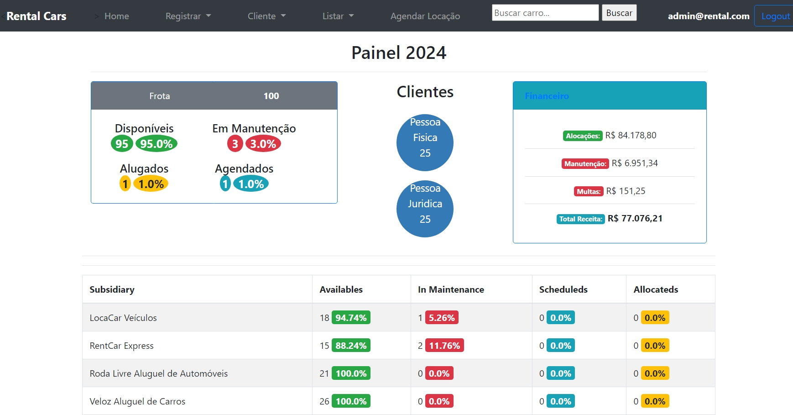
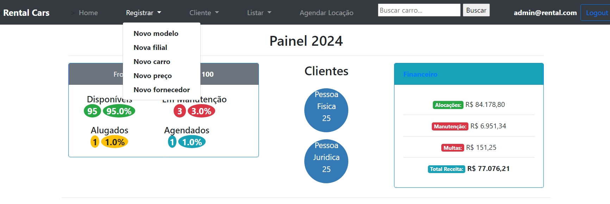
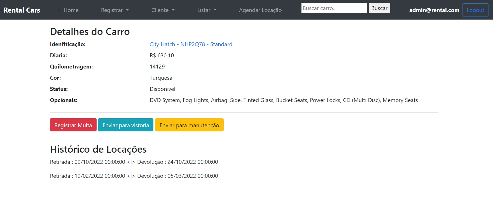
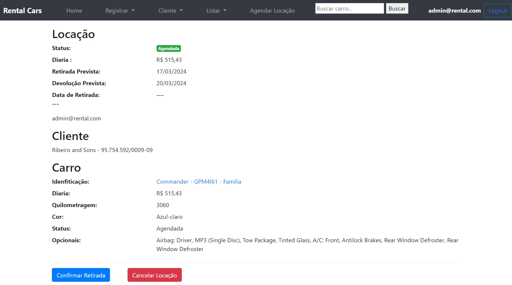
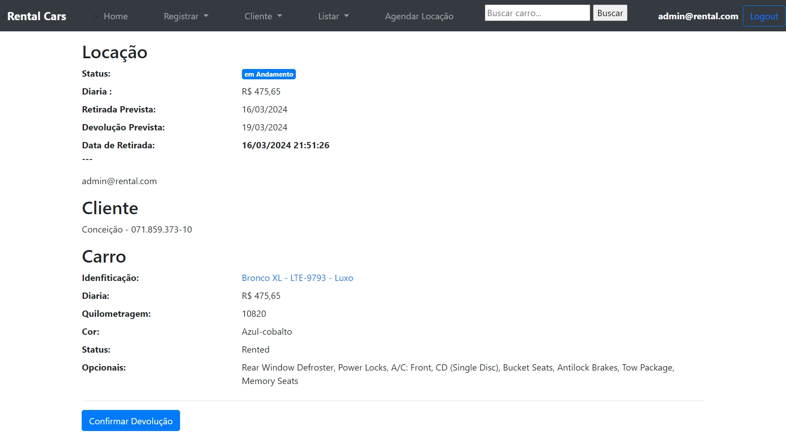
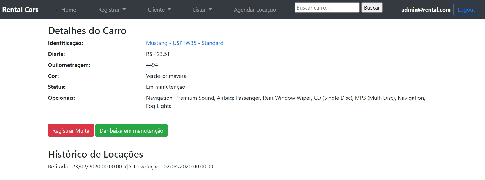

# Rental Cars

Rental Cars é um projeto de sistema administrativo de uma empresa que aluga
carros para o público em geral (pessoa fisica e juridica). O foco do sistema é gerenciar a frota de carros, os clientes e as unidades (filiais) da empresa.

Principais Características e Funcionalidades

- O projeto RentalCars é focado somente nos funcionários da empresa de locação, servindo como um sistema interno e não como um site onde os clientes podem agendar locações
-    O sistema administra o cadastro de filiais (subsidiaries)
-    O sistema gerencia categorias de carros e modelos de carros disponíveis para locação, sem distinção de filiais
-    A categoria de um carro define seu preço padrão de locação, no entanto é possívei customizar os preços de locação por filial
-    Um carro da frota deve ser sempre vinculado a um a filial
-    Uma locação deve ser agendada, definindo o cliente, as datas de retirada e devolução e a categoria de carro. Nesse momento é feita uma validação de que existem carros disponíveis no período escolhido.
-    Ao finalizar o agendamento é gerado um código único da locação
-    Ao iniciar a locação, deve ser escolhido o carro de acordo com a categoria escolhida
-    Uma locação deve ser composta de ao menos um carro e 0 ou N acessórios adicionais (AddOns) além de 0 ou N coberturas de seguro
-   Registrar Multas, Vistoria e Manutenção, somente para carros com status "available".
-   Registrar empresas que prestam serviço de manutenção.

## OBS: Projeto original do curso da CampusCode de 2019; copia do repositorio de bragamat link "https://github.com/bragamat/rental-cars-workshop"

- Este projeto foi atualizado :  
  Ruby '2.6.4'            ==>  Ruby '3.2.0' 
  Ruby on  Rails '5.2.3'  ==>  Ruby on Rails '7.1.0' 
  Sqlite3                 ==>  PostgreSql
  Passos realizados para a atualização
    - Clone do projeto do github para minha maquina.
    - Criei um projeto em Ruby on Rails 7 (rails new Workshop_Rental_Cars --database= postgresql -T)
    - Inclusão das gens do projeto original que não existem no projeto criado.
    - Executar  bundle update.
    - Executar bundle check.
    - Copia do conteudo das pastas Controller, Migrate do projeto original para o atual.
    - Execução rails g devise:install
    - Copia do conteudo das pastas routes, view do projeto original para o atual
    - Executar rails db:create
    - Executar rails db:migrate
    - Copia do conteudo da pasta Model do projeto original para o atual
    - Executar rails generate rspec:install
    - Copia da pasta spec do projeto original para o atual
    - Alterar assets/stylesheets/application.css  para  assets/stylesheets/application.scss 
    - Incluir @import "bootstrap";  em assets/stylesheets/application.scss
    - Incluir import "jquery";  import "bootstrap";    em app/javascript/application.js

- Acrescentado novos teste, atingindo 90% de cobertura (boa parte dos testes utilizando IA).

- Todas as gens foram atualizadas para as ultimas versões para Ruby on Rails 7.1.0.; exceto a gem do Bootstrap 4.3.1

- Incluido validates para a maioria dos models.
- Modificações em layouts, inclusão de um navbar, criação painel para Home/Index
- Alterada regra de negocio, onde personal client so pode fazer uma nova alocação, quando não há  uma alocação em andamento; e o company client não tem restrição.
- Incluido rotina para cancelamento de uma alocação, que ainda não foi ativada, com envio de email para o cancelamento.

## Algumas Views
. Home Index

. Navbar

. Detalhes Carro

. Carro Agendado

. Carro Alocado

. Carro em Manutenção

## Como iniciar o projeto

Para executar esse projeto você deve ter um computador, preferencialmente com
Linux, com a linguagem de programação Ruby na versão 3.2.0.

Dentro do diretório do projeto, você deve instalar as dependências definidas no
arquivo `Gemfile` com o comando `bundle install`.

Criação da base de dados
- rails db:create
- rails db:migrate
- rails db:seed  
    OBS: Caso não queira popular a base dados, NÃO executar "rails db:seed", será necessario criar uma subsidiaria e um usuario desta forma :
    - rails c
    - Subsidiary.create(name: 'Unidade São Bernardo')
      - E importante pegar o id da criação da Subsidiary
    - User.create(email: 'admin@rental.com', password: '123456', subsidiary_id: XXX, role: 10)
      - Onde XXX e o id da Subsidiary criada acima

Com todas dependências instaladas, execute `rails server` e acesse
`localhost:3000` em seu navegador.

Login com
- email => admin@rental.com  password => 123456   ou 
- email => manager1@rental.com  password => 123456

## Executando os testes

Com todas dependências instaladas, como descrito na seção anterior, em seu
terminal execute 
- `bundle exec rspec`.

